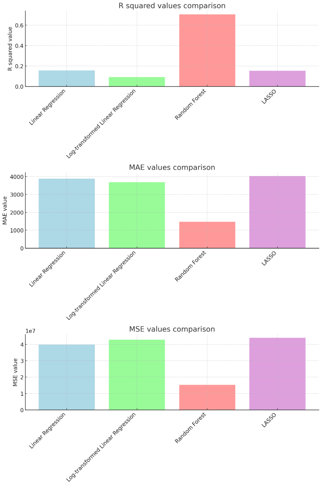

<link rel="stylesheet" href="styles.css" type="text/css">
<link rel="stylesheet" href="site_libs/academicons-1.9.1/css/academicons.min.css"/>

   

## **Predicting Customer Lifetime Value**

 

   

### 1. Figure

[Fig. Graph comparing key metrics by model]

 

  

### 2. Goal
The goal of the analysis was to evaluate and compare the performance of various predictive models in estimating "Customer Lifetime Value" from customer insurance data, using metrics like MSE, RMSE, and MAE. Through visualizations, the analysis aimed to identify the most effective model based on these metrics.

 

### 3. Methodology & Summary

  + Predict the customer lifetime value using four models: Linear Regression, Log-transformed Linear Regression, Random Forest, and LASSO.
  + The Random Forest model outperforms the others with the highest $R^2$ value of 0.707 and the lowest MAE of 1467.39. In contrast, the Log-transformed Linear Regression has the lowest $R^2$ value of 0.0907, while LASSO reports the highest MAE of 4025.79.  
  + The Linear Regression, Log-transformed Linear Regression, and LASSO models have comparable performance, with the Log-transformed Linear Regression having a slightly better MAE but worse MSE than the standard Linear Regression.
  + In conclusion the Random Forest model has the highest $R^2$ value, the lowest MAE, and the lowest MSE, making it the best performing model among the four based on these metrics.

 

### 4. Code

Please click [HERE](https://nbviewer.org/github/lee-jh-data/lee-jh-data.github.io/blob/main/files/lifetimevalue_02.ipynb) for the analysis report and code.

 

