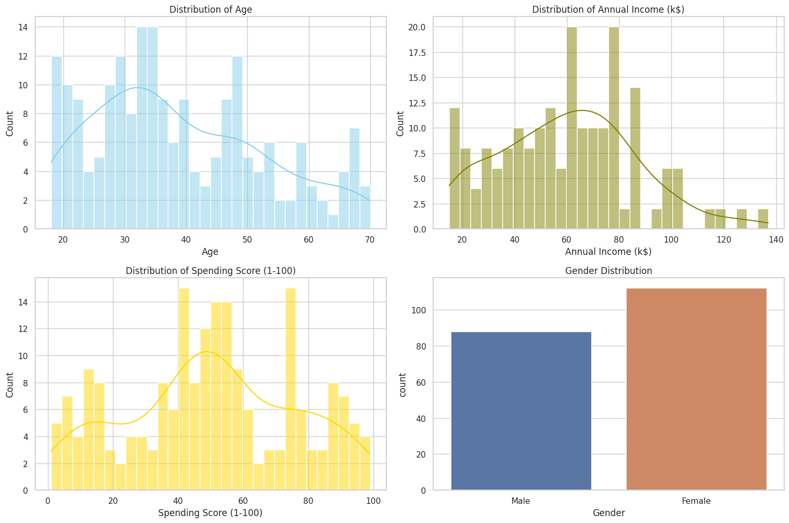
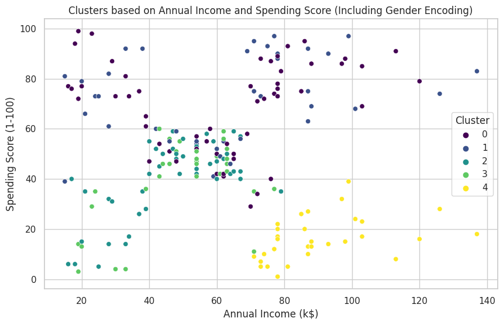

<link rel="stylesheet" href="styles.css" type="text/css">
<link rel="stylesheet" href="site_libs/academicons-1.9.1/css/academicons.min.css"/>

   

## **Clustering - Customer Segmentation**

 

   

### 1. Figure

[Fig. Customer segmentation based on income and spending pattern]

 

  

### 2. Goal
The purpose of the analysis is to segment mall customers into distinct groups based on their annual income and spending behaviors, enabling the development of targeted marketing strategies and personalized customer engagement. This segmentation helps in understanding diverse customer profiles and optimizing marketing efforts for better customer relationship management.

 

### 3. Methodology

  + The analysis began with importing relevant libraries and the mall customer dataset, followed by encoding the categorical 'Gender' variable into numerical format.
  + The K-Means algorithm was applied to the standardized dataset to segment customers into clusters, with the optimal number of clusters determined using the elbow method.
  
 

### 4. Summary
  + The analysis successfully segmented the mall customers into five distinct groups, revealing varied patterns in income and spending. 
  + The most valuable segment is Cluster 2, comprising affluent customers with high spending, making them ideal targets for luxury and high-value products. Conversely, Cluster 3 is the least valuable segment, as these customers have low income and spending, indicating limited purchasing power and cautious spending behavior.

 

### 5. Code

Please click [HERE](https://nbviewer.org/github/lee-jh-data/lee-jh-data.github.io/blob/main/files/Customer_Segmentation.ipynb) for the analysis report and code.

 

