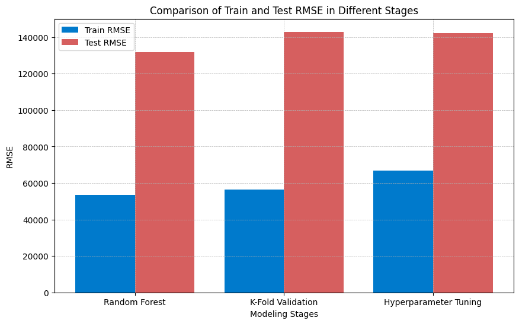

<link rel="stylesheet" href="styles.css" type="text/css">
<link rel="stylesheet" href="site_libs/academicons-1.9.1/css/academicons.min.css"/>

   

## **Predicting Used Car Price**

 

   

### 1. Figure

[Fig. Comparison of Train and Test RMSE in Different Stages]

 

  

### 2. Goal
The goal of this analysis is to predict future used car prices using second-hand car sales data. A random forest model will be employed for this purpose, and through K-fold validation and hyperparameter tuning, we will compare each of the test_rmse and train_rmse variables.

 

### 3. Methodology

  + The random forest model was utilized, employing test_rmse and train_rmse for evaluation. Each metric was compared using K-fold validation. However, to refine the modeling further, key variables such as max_depth, min_samples_split, and min_samples_leaf were adjusted.
  
 

### 4. Summary
  + The initial Random Forest modeling showed a low **train_rmse** (53,531.42) and a high **test_rmse** (131,855.18), suggesting overfitting to the training data.
  + The **K-Fold Cross Validation** results indicated increased errors with a **train_rmse** of 56,553.84 and a **test_rmse** of 142,936.59, reflecting the model's performance in a more generalized evaluation.
  + After **hyperparameter tuning**, the **train_rmse** increased to 66,762.85, while the **test_rmse** slightly decreased to 142,205.83, indicating a reduction in overfitting to the training data and some improvement in performance.
  + Overall, the model has shown some improvement from the initial overfitting, but still maintains a high error rate for the test data. These results suggest a need for further hyperparameter adjustments and considering different model structures or learning methods.
  + Future enhancements in the model's performance may require a reevaluation of data quality, feature selection, and exploring various modeling approaches.

 

### 5. Code

Please click [HERE](https://gist.github.com/lee-jh-data/ee2c36740082eee590598df0435be6ed) for the analysis report and code.

 

