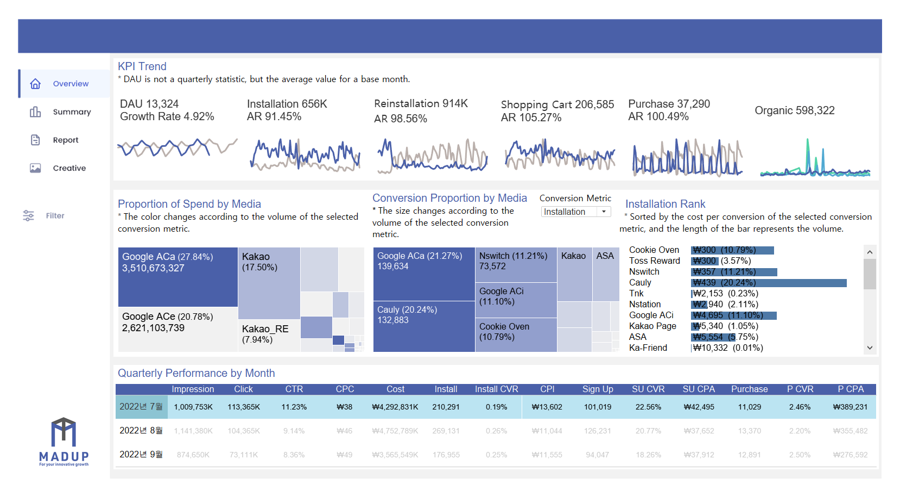
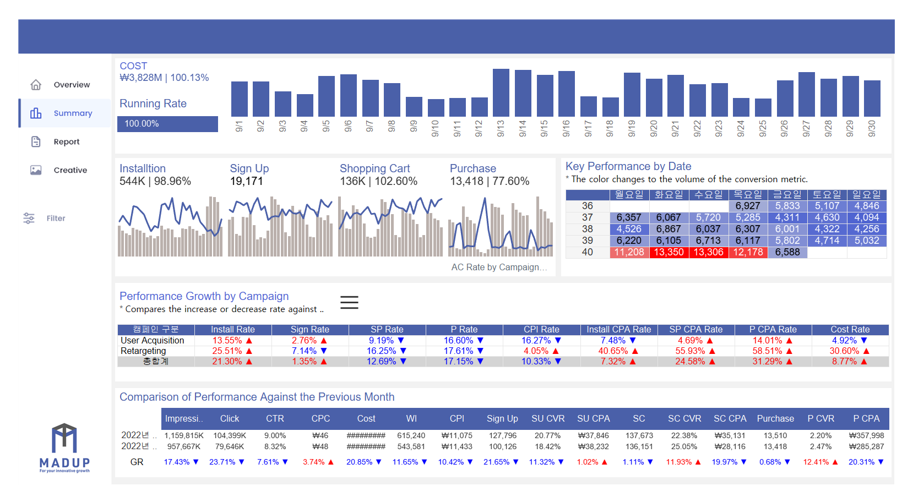
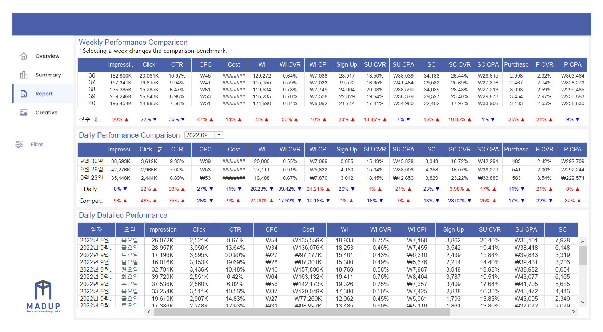
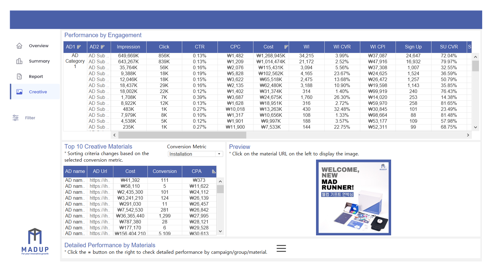

<link rel="stylesheet" href="styles.css" type="text/css">
<link rel="stylesheet" href="site_libs/academicons-1.9.1/css/academicons.min.css"/>

   

## **E-commerce App In-App Activity Data Dashboard**

 

   

### 1. Screenshot of Dashboard

   

### 2. Summary

+ The dashboard has been developed for an e-commerce client to track advertising data and in-app activities (app installation, adding to cart, purchases) in real-time.
+ The dashboard is comprised of four main sections: Overview, Summary, Report, and Creative.
+ The Overview section is designed to monitor Key Performance Indicators (KPIs) collected from all advertising channels in real-time. It allows for an at-a-glance comparison of KPI trends, as well as advertising expenditure and performance across various media.
+ The Summary section is created to summarize and review key metrics from all media on a time-based scale.
+ The Report section is developed for a more detailed examination of performance, enabling the review of key metrics on a daily, weekly, and by-week basis.
+ The Creative section is designed to analyze the performance of each advertising creative. Integrated with each advertising platform’s API, it allows users to click on an ad name within the dashboard and view the ad image directly.

   

